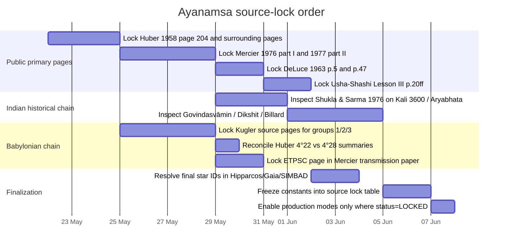

# Authoritative Source Lock Report for Remaining Ayanamsa Modes and Ephemeris Inputs

## Executive summary

The ephemeris side of your engine matrix is already on firm public ground. For high-precision runtime data, the authoritative path is JPL/NAIF DE kernels, especially DE440 for modern data and DE441 for deep historical spans; for analytical fallback, the authoritative public coefficient sources are VSOP87 in CDS/VizieR catalog VI/81 and ELP2000-82B in CDS/VizieR catalog VI/79. SOFA is the IAU reference implementation for time scales, precession, nutation, Earth rotation, and related standards, and ERFA provides a BSD-licensed SOFA-derived C library. Hipparcos and Gaia are the authoritative public catalogs for stellar anchor work. In other words, the planetary and lunar engine matrix can be completed from official/public sources now; the main remaining uncertainty is not ephemeris generation, but ayanamsa provenance and exact mode locking. citeturn16view0turn16view1turn19view0turn15view0turn14view0turn10view1turn10view2turn20search1turn20search15turn9search1turn9search5

For the ayanamsa modes you listed, the public literature falls into three implementation contracts that are stable enough for C code: a frozen zero-epoch origin, a direct epoch-offset polynomial, or a permanent fixed-star anchor. That contract split is more important than the mode names themselves, because it lets you implement one exact computational architecture and then attach source-locked constants per mode. This is the safest way to finish the matrix without inventing constants. citeturn46view0turn46view1turn47view0turn48view4

The current source-lock status is mixed. BABYL_HUBER is closest to a public lock; HIPPARCHOS, SASSANIAN, USHASHASHI, DELUCE, and ARYABHATA have strong public source trails but still need page-locked primary confirmation for final constants; BABYL_KUGLER1/2/3 and BABYL_ETPSC are operationally reconstructible from public secondary notes but not yet fully primary-locked; JN_BHASIN remains genuinely unsourced as a numeric mode in the public material located here. The correct engineering posture is to mark each unresolved row as `PARTIAL_PRIMARY`, `PROVISIONAL_SECONDARY`, or `UNSOURCED`, and to ship exact formulas only where the page image or formal paper has been pinned. citeturn39search1turn39search16turn46view0turn46view1turn47view0turn48view1turn48view4turn53view0turn41search1

## Ayanamsa source priorities and lock status

The table below is the implementation-facing summary. “Recommended operational model” means the modern computational model to use in your code until and unless the primary source explicitly demands a historical trepidation law or another legacy convention.

| Mode | Priority public source set | Working contract now | Best public numeric clue now | Recommended operational model | Status |
|---|---|---|---|---|---|
| ARYABHATA | Shukla & Sarma 1976; Clark 1930; Dikshit; Billard/Mercier | Zero-epoch equinox contract; alternate 522 CE tradition contract | 499 CE zero from Aryabhata-derived equinox; alternate 522 CE from Govindasvāmin tradition | IAU 2006 precession, mean ecliptic/equinox of date | PARTIAL_PRIMARY |
| BABYL_ETPSC | Mercier 1976–77; later Mercier transmission paper; compare Huber/Britton | Fixed-star/culmination contract tied to η Psc hypothesis | −5°04′46″ at year −129 in public implementation note | IAU 2006/2000A true-of-date if treated as permanent star anchor | PROVISIONAL_SECONDARY |
| BABYL_HUBER | Huber 1958; Britton 2010; Steele 2007 | Epoch-offset contract | Around −4°28′ at year −100; uncertainty band ±20′ reported | IAU 2006 precession, mean ecliptic/equinox of date | NEAR_LOCKED |
| BABYL_KUGLER1 | Kugler, *Sternkunde und Sterndienst in Babel* | Epoch-offset contract | −5°40′ at year −100 in public implementation note | IAU 2006 precession, mean ecliptic/equinox of date | PROVISIONAL_SECONDARY |
| BABYL_KUGLER2 | Kugler, *Sternkunde und Sterndienst in Babel* | Epoch-offset contract | −4°16′ at year −100; Spica at 29°26′ Virgo in public note | IAU 2006 precession, mean ecliptic/equinox of date | PROVISIONAL_SECONDARY |
| BABYL_KUGLER3 | Kugler, *Sternkunde und Sterndienst in Babel* | Epoch-offset contract | −3°25′ at year −100 in public implementation note | IAU 2006 precession, mean ecliptic/equinox of date | PROVISIONAL_SECONDARY |
| DELUCE | DeLuce 1963 | Zero-epoch contract | De facto 26°24′47″ at 1900 implies zero around 4 Jun 1 BCE | IAU 2006 precession, mean ecliptic/equinox of date | PARTIAL_PRIMARY |
| HIPPARCHOS | Mercier 1976–77 | Fixed-star anchor near ζ Psc / Revati | 27 Jun −128, ayan ≈ −9°20′; zero 10′–22′ east of ζ Psc in Mercier summary | IAU 2006/2000A true-of-date with ζ Psc anchor | PARTIAL_PRIMARY |
| JN_BHASIN | Bhasin prefaces/books not yet pinned | Unknown; default to zero-epoch research contract only for research, not production | Secondary zero-date index places it near 364 CE | Do not ship until source found | UNSOURCED |
| SASSANIAN | Mercier 1976–77; Kennedy 1958; Kennedy & van der Waerden 1963 | Fixed-star anchor / zero-epoch hybrid in Revati family | 18 Mar 564 07:53:23 UT/ET as zero; ζ Psc ≈ 29°49′59″ | IAU 2006/2000A true-of-date with ζ Psc anchor | PARTIAL_PRIMARY |
| USHASHASHI | Usha-Shashi 1978/2005; Mercier 1976–77 | Fixed-star anchor in Revati family | 18°39′39.46 on 1900-01-01; zero around 560 CE in public note | IAU 2006/2000A true-of-date with ζ Psc anchor | PARTIAL_PRIMARY |

### Aryabhata

The public primary trail for ARYABHATA is good, but it does not yet reduce to one uncontested numeric constant. The primary text is *Āryabhaṭīya of Āryabhaṭa* in the critical 1976 edition by K. S. Shukla and K. V. Sarma; Clark’s 1930 English translation is a public-domain translation that is still useful for rapid inspection. Mercier’s later historical-computation paper, summarizing Billard’s deviation curves, states that the zero-ayanāṃśa years for Āryabhaṭa and later Indian astronomers lie in the fifth century and that the sidereal origin is at or within about one degree of ζ Piscium (Revatī). A public implementation note derived from those historical discussions then exposes two competing operational contracts: a 499 CE equinox-based zero and a later 522 CE tradition attributed to Govindasvāmin. That means ARYABHATA should not yet be hard-coded as a single source-locked numeric mode; instead, treat it as two explicit candidate contracts until the underlying pages in Shukla/Sarma, Govindasvāmin, and Billard are locked. citeturn26search1turn26search2turn42search13turn47view0

**Exact next-step documents for lock:** Shukla & Sarma vol. 1 introduction and notes around Kali 3600 and equinox assumptions; Govindasvāmin’s commentary passage for Śaka 444 / 522 CE; Billard’s deviation curves in *L’Astronomie Indienne*; Dikshit’s discussion of Aryabhata in *History of Indian Astronomy, Part II*. citeturn26search1turn42search9turn42search13

### Babylonian modes

The Babylonian group is historically rich but source-fragmented. Huber’s 1958 paper *Über den Nullpunkt der babylonischen Ekliptik* is the primary public citation for BABYL_HUBER, and later scholarly writing explicitly points back to Huber p. 204 for an offset of about 4°28′ in year −100. Public implementation notes built from Kugler, Huber, Mercier, and Britton then expose three Kugler groups at year −100, with offsets −5°40′, −4°16′, and −3°25′, plus Huber’s revised −4°28′ and Mercier’s η Piscium possibility at −5°04′46″ for year −129. There is one complication: a later scholarly summary reports Huber’s Babylonian zero point in −100 as 4°22′, while another recent scholarly article explicitly quotes Huber p. 204 as 4°28°. That discrepancy is small but real, so BABYL_HUBER should be treated as `NEAR_LOCKED` rather than fully locked until the page image of Huber 1958 is pinned. citeturn39search1turn39search16turn35search3turn48view4

For BABYL_KUGLER1/2/3, the exact implementation contract is clear enough—an epoch-offset contract around year −100—but the exact Kugler pages have not been pinned in a public scan here. So the engineering advice is simple: you may store the public operational constants in metadata for research builds, but production should still flag these modes `PROVISIONAL_SECONDARY` until the relevant pages in *Sternkunde und Sterndienst in Babel* are page-locked. For BABYL_ETPSC, the public note explicitly attributes the mode to Mercier’s suggestion that the zero point may have been defined by the ecliptic point culminating simultaneously with η Piscium; that makes it a candidate permanent-star-anchor mode, but again the underlying Mercier page must be locked before final shipment. citeturn48view3turn48view4turn39search5

**Exact next-step documents for lock:** Huber 1958 full PDF, especially p. 204; Kugler’s *Sternkunde und Sterndienst in Babel* pages where the three observational groups are enumerated; Mercier 1977 part II plus the later transmission paper section that discusses η Piscium; Britton 2010 pp. around 630 for his revision of Huber. citeturn39search1turn39search3turn35search2turn48view4

### DeLuce

DELUCE has a single obvious primary source: Robert DeLuce, *Constellational Astrology According to the Hindu System* (Los Angeles, 1963). Public implementation notes summarizing DeLuce say he theoretically fixed the ayanamsa at the birth of Jesus on 1 January 1 CE, but that his actual operational value was 26°24′47″ in the year 1900, which corresponds to a zero-ayanamsa date of about 4 June 1 BCE. The same note cites DeLuce p. 5 as the source trail. That is enough to define the correct implementation contract—zero epoch, not fixed star—but not enough to mark the numeric epoch fully locked until p. 5 and any relevant explanatory pages are photographed or scanned. citeturn48view1turn43search17

**Exact next-step documents for lock:** DeLuce 1963 p. 5 for zero-date statement and any later page where he explains the practical ayanamsa table; if available, also inspect p. 47 because later astrological literature repeatedly points to that page when discussing DeLuce’s age/zodiac framework. citeturn48view1turn43search16

### Hipparchos, Sassanian, and Usha-Shashi

These three belong to the same historical family. Mercier’s study of medieval precession is the central source trail. Public summaries of Mercier report that the ancient Greek and medieval Arabic astronomers placed the ecliptic zero somewhere between about 10 and 22 arcminutes east of ζ Piscium, and that Mercier associated this with Hipparchus. The same public summary then gives a concrete Hipparchos test date of 27 June −128 with ayan ≈ −9°20′ and explains that the ideal zero should have lain near, but not exactly at, that derived numerical point because of rounding in the ancient star catalogue. For SASSANIAN, the same Mercier-based public note gives a zero date of 18 March 564 at 07:53:23 UT/ET, tied to the Sassanian reform of the *Zīj al-Shāh* under Khusrau Anūshirwān, and places ζ Piscium at 29°49′59″. For USHASHASHI, the public note explicitly says it uses the same Revatī-family zero point and reports an ayanamsa of 18°39′39.46 at 1900-01-01, while the public preview of *Vedic Astrological Calculations* confirms that the book has a dedicated Ayanamsha chapter beginning at p. 20. citeturn46view0turn46view1turn28view2turn28view7turn44search14turn44search15

This means all three should be implemented as Revati-family fixed-star-anchor modes in the modern codebase, using a modern star transformation pipeline, unless the primary historical source explicitly states a different rule. HIPPARCHOS remains `PARTIAL_PRIMARY` because the exact fiducial definition is historically subtle. SASSANIAN is stronger numerically because a concrete zero date is already exposed in the public summary. USHASHASHI is strong conceptually but still needs the exact rule from the author’s own chapter. citeturn46view0turn46view1

**Exact next-step documents for lock:** Mercier 1976 part I and 1977 part II; Kennedy’s 1958 paper on the *Zīj al-Shāh*; Kennedy and van der Waerden 1963 on the Persian world-year; Usha-Shashi, lesson III “Ayanamsha”, pp. 20ff. citeturn45view0turn34search4turn33search6turn28view7

### JN Bhasin

JN_BHASIN is the one remaining mode for which a secure public numeric definition has not been located in this pass. Public implementation notes mention only that this ayanamsa “was used by the Indian astrologer J.N. Bhasin,” and public zero-point indexes place its coincidence year around 364 CE, but no primary page stating the rule, star, epoch, or polynomial was found here. Since Bhasin’s known published work includes major translations and interpretive texts rather than an obviously public ayanamsa monograph, this mode must be treated as `UNSOURCED` for production purposes. citeturn53view0turn41search1turn29search3

**Exact next-step documents for lock:** Bhasin prefaces and appendices in *Sarvarth Chintamani* translation, *The Art of Prediction in Astrology*, *Astro Sutras*, and any separate article or pamphlet on ayanamsa; search especially for a stated zero year, “Revati,” “Chitra,” or a reference-year ayanamsa table. citeturn29search1turn29search3

## Core ephemeris inputs and official downloads

For planets and the Moon, the recommended authoritative stack is straightforward. Use JPL DE440 as your default full modern kernel; switch to DE441 when you need reliable historical work outside DE440’s 1550–2650 span, because the DE440/DE441 paper explicitly recommends DE440 for modern data analysis and DE441 for historical data before the DE440 range. The NAIF directory confirms the currently distributed kernel files and their sizes: `de440s.bsp` 31M, `de440.bsp` 114M, and `de441_part-1.bsp` plus `de441_part-2.bsp` at 1.5G each. JPL’s paper also states that the DE series is integrated in TDB and tied to the ICRS. citeturn16view0turn16view1turn19view0

VSOP87 and ELP2000-82B are the authoritative public analytical sources. The VSOP87 ReadMe explicitly identifies the catalog as VI/81, cites Bretagnon & Francou 1988, describes the A/B/C/D/E variants and their coordinate conventions, and lists every coefficient file with record counts. The ELP2000-82B ReadMe identifies catalog VI/79, cites Chapront-Touzé & Chapront 1983 and 1988, states that the ephemeris is fit to JPL DE200/LE200, and lists 36 data files plus the reference PostScript note and example Fortran source. Estimating unpacked size from `Lrecl × Records`, the full VI/81 package is about 36.0 MB decimal, with the frequently used VSOP87D subset about 4.19 MB; VI/79 is about 3.77 MB total, with about 2.46 MB in the 36 ELP series files alone. citeturn15view0turn14view0

SOFA remains the official IAU reference implementation. Its current software page lists the 2023-10-11 issue and explicitly includes support for the IAU 2006 precession model and IAU 2000A nutation, among other standards. Its terms page allows use and adaptation, including commercial use, but requires derived works to avoid the `iau`/`sofa` routine prefixes and to mark derivation clearly. If you want a permissive drop-in C library without SOFA’s naming restrictions, ERFA is the standard BSD-style derivative. For stellar anchors, Hipparcos remains the classic all-sky bright-star catalog and Gaia DR3 is the modern bulk source; ESA’s Gaia DR3 page says the full bulk download is about 10 TB, and ESA’s Hipparcos catalog page says the printed catalog consists of 16 volumes plus volume 17 containing 6 ASCII CD-ROMs. SIMBAD is useful for name resolution and bibliography, but SIMBAD itself warns that it is a dynamic database and “not a catalogue.” citeturn10view1turn10view2turn9search1turn9search5turn20search1turn20search15turn21search13

Meeus remains a practical secondary implementation source rather than a primary ephemeris source. The current AAS/Sky Publishing listing identifies *Astronomical Algorithms*, 2nd ed., as Jean Meeus, 1999, 477 pages; ADS indexes the work as the well-known general celestial-calculation compendium. That makes Meeus appropriate as a practical check or fallback reference for classical formulas, but not a substitute for official JPL kernels, SOFA, or the original VSOP/ELP coefficient sets. citeturn54search1turn54search16

### Direct download endpoints

The URLs below are the official/public distribution points or landing pages corresponding to the sources above. citeturn19view0turn15view0turn14view0turn10view1turn20search1turn20search15

```text
JPL / NAIF kernels
https://naif.jpl.nasa.gov/pub/naif/generic_kernels/spk/planets/
https://naif.jpl.nasa.gov/pub/naif/generic_kernels/spk/planets/de440s.bsp
https://naif.jpl.nasa.gov/pub/naif/generic_kernels/spk/planets/de440.bsp
https://naif.jpl.nasa.gov/pub/naif/generic_kernels/spk/planets/de441_part-1.bsp
https://naif.jpl.nasa.gov/pub/naif/generic_kernels/spk/planets/de441_part-2.bsp
https://ssd.jpl.nasa.gov/doc/Park.2021.AJ.DE440.pdf

VSOP87
https://cdsarc.cds.unistra.fr/viz-bin/cat/VI/81
https://cdsarc.cds.unistra.fr/viz-bin/ReadMe/VI/81?format=html&tex=true

ELP2000-82B
https://cdsarc.u-strasbg.fr/viz-bin/cat/VI/79
https://cdsarc.cds.unistra.fr/viz-bin/ReadMe/VI/79?format=html&tex=true

SOFA / ERFA
https://www.iausofa.org/current-software
https://www.iausofa.org/terms-and-conditions
https://github.com/liberfa/erfa

Hipparcos / Gaia
https://www.cosmos.esa.int/web/hipparcos/catalogues
https://www.cosmos.esa.int/web/gaia/dr3
https://gea.esac.esa.int/archive/

Meeus
https://shopatsky.com/products/astronomical-algorithms-2nd-edition
```

### Dataset footprint comparison

| Artifact | Official evidence | Approximate size | Notes |
|---|---|---:|---|
| `de440s.bsp` | NAIF directory listing | 31M | Small DE440 kernel option |
| `de440.bsp` | NAIF directory listing | 114M | Full DE440 kernel |
| `de441_part-1.bsp` + `de441_part-2.bsp` | NAIF directory listing | 3.0G combined | Full DE441 split kernel |
| VSOP87 VI/81 complete package | VizieR ReadMe record counts | ~36.0 MB decimal | Estimated as `Lrecl × Records` |
| VSOP87D subset only | VizieR ReadMe record counts | ~4.19 MB decimal | Often the best spherical-of-date subset |
| ELP2000-82B VI/79 complete package | VizieR ReadMe record counts | ~3.77 MB decimal | Includes 36 series files, doc, example code |
| ELP 36 series files only | VizieR ReadMe record counts | ~2.46 MB decimal | Main coefficient payload |
| Gaia DR3 bulk | ESA Gaia DR3 page | ~10 TB | Modern star-anchor bulk source |
| Hipparcos catalog set | ESA Hipparcos catalog page | 16 vols. + vol. 17 / 6 ASCII CD-ROMs | Classic bright-star source |

The NAIF sizes are explicit. The VSOP87 and ELP sizes above are calculated from the catalog ReadMe line lengths and record counts, so they are approximate unpacked footprints rather than file-system measurements. citeturn19view0turn15view0turn14view0turn20search1turn20search15

## Implementation contracts and exact algorithms

The safest implementation architecture is: compute a tropical longitude in a precisely defined frame and timescale, compute the ayanamsa in the **same** frame and timescale, then subtract. In symbols:

```text
lambda_sidereal = wrap360(lambda_tropical - ayanamsa)
```

If the planetary longitude is apparent true-ecliptic-of-date, the ayanamsa must also be the apparent true-ecliptic longitude of the sidereal origin. If the planetary longitude is mean ecliptic/equinox of date, the ayanamsa must also be mean-of-date. SOFA provides the standard precession/nutation machinery, JPL DE uses TDB internally, and NOVAS states the exact calendar/time-scale relations `TT = UTC + ΔAT + 32.184 s` and `ΔT = TT - UT1`. For historical dates, Espenak–Meeus gives a standard public piecewise polynomial approximation for ΔT over −1999 to +3000. citeturn10view1turn16view1turn52search5turn52search0turn52search6

### Recommended numeric representation

Use this representation policy in C:

```c
typedef enum {
    AYAN_MEAN_OF_DATE,
    AYAN_TRUE_OF_DATE
} ayan_coord_mode_t;

typedef enum {
    AYAN_ZERO_EPOCH,
    AYAN_POLYNOMIAL,
    AYAN_STAR_ANCHOR
} ayan_contract_t;

typedef struct {
    double jd1;   // high part of TT Julian Date
    double jd2;   // low part of TT Julian Date
} jd2_t;

/* Store coefficient values as decimal strings or exact integer arcseconds
   at compile time; parse to long double once at initialization. */
typedef struct {
    ayan_contract_t contract;
    ayan_coord_mode_t coord_mode;
    jd2_t epoch_tt;
    const char *anchor_name;             // "zeta Psc", "eta Psc", "Spica", ...
    long double anchor_sidereal_deg;     // target sidereal longitude if star-anchor
    int ncoef;
    const long double *coef_arcsec;      // Horner order, source units preserved
    int source_status;                   // LOCKED / PARTIAL / PROVISIONAL / UNSOURCED
} ayan_mode_def_t;
```

Use split Julian dates throughout, exactly as SOFA and NOVAS do. Use `double` for stored celestial states and official library calls; use `long double` for polynomial accumulation, JD arithmetic, and final angle normalization when you want maximal numeric headroom. For lossless regression capture, emit every floating result both as decimal and as IEEE-754 hexfloat (`%a`) or raw 8-byte bytes; compare hexfloat/raw bytes in your engine matrix tests rather than rounded decimal text. That avoids false diffs created by text formatting. The split-JD pattern and time-scale chain are standard SOFA/NOVAS practice. citeturn10view1turn52search1turn52search5

### Time-scale helpers

```c
/* UTC civil input -> TT split JD, using SOFA or ERFA */
int utc_to_tt(int y, int m, int d, int hh, int mm, double ss,
              jd2_t *tt_out)
{
    double utc1, utc2, tai1, tai2, tt1, tt2;
    int j;

    /* Parse civil UTC to split JD. */
    j = iauDtf2d("UTC", y, m, d, hh, mm, ss, &utc1, &utc2);
    if (j) return j;

    /* UTC -> TAI (applies leap seconds). */
    j = iauUtctai(utc1, utc2, &tai1, &tai2);
    if (j) return j;

    /* TAI -> TT : TT = TAI + 32.184 s */
    j = iauTaitt(tai1, tai2, &tt1, &tt2);
    if (j) return j;

    tt_out->jd1 = tt1;
    tt_out->jd2 = tt2;
    return 0;
}

/* TT -> TDB if needed by JPL or CALCEPH/SPICE path.
   In a geocentric implementation, obtain dtr from the SOFA model or let the
   ephemeris library manage its own TT/TDB handling. */
int tt_to_tdb(jd2_t tt, double dtr_seconds, jd2_t *tdb_out)
{
    double tdb1, tdb2;
    int j = iauTttdb(tt.jd1, tt.jd2, dtr_seconds / 86400.0, &tdb1, &tdb2);
    if (j) return j;
    tdb_out->jd1 = tdb1;
    tdb_out->jd2 = tdb2;
    return 0;
}
```

This follows the official chains described by SOFA, NOVAS, and the DE440/441 paper. Keep the SOFA leap-second table current, or use the SOFA/ERFA `DAT` update workflow exactly as intended. citeturn10view2turn16view1turn52search5

### Delta-T helper

```c
/* Espenak-Meeus polynomial ΔT = TT - UT1, valid for -1999..+3000.
   y must be decimal year: year + (month - 0.5)/12.0 */
long double delta_t_espenak_meeus(long double y)
{
    long double u, t;

    if (y < -500.0L) {
        u = (y - 1820.0L) / 100.0L;
        return -20.0L + 32.0L*u*u;
    } else if (y < 500.0L) {
        u = y / 100.0L;
        return 10583.6L
             - 1014.41L*u
             +   33.78311L*u*u
             -    5.952053L*u*u*u
             -    0.1798452L*u*u*u*u
             +    0.022174192L*u*u*u*u*u
             +    0.0090316521L*u*u*u*u*u*u;
    } else if (y < 1600.0L) {
        u = (y - 1000.0L) / 100.0L;
        return 1574.2L
             - 556.01L*u
             +  71.23472L*u*u
             +   0.319781L*u*u*u
             -   0.8503463L*u*u*u*u
             -   0.005050998L*u*u*u*u*u
             +   0.0083572073L*u*u*u*u*u*u;
    } else if (y < 1700.0L) {
        t = y - 1600.0L;
        return 120.0L - 0.9808L*t - 0.01532L*t*t + t*t*t/7129.0L;
    } else if (y < 1800.0L) {
        t = y - 1700.0L;
        return 8.83L + 0.1603L*t - 0.0059285L*t*t
             + 0.00013336L*t*t*t - t*t*t*t/1174000.0L;
    } else if (y < 1860.0L) {
        t = y - 1800.0L;
        return 13.72L - 0.332447L*t + 0.0068612L*t*t
             + 0.0041116L*t*t*t - 0.00037436L*t*t*t*t
             + 0.0000121272L*t*t*t*t*t
             - 0.0000001699L*t*t*t*t*t*t
             + 0.000000000875L*t*t*t*t*t*t*t;
    } else if (y < 1900.0L) {
        t = y - 1860.0L;
        return 7.62L + 0.5737L*t - 0.251754L*t*t
             + 0.01680668L*t*t*t - 0.0004473624L*t*t*t*t
             + t*t*t*t*t/233174.0L;
    } else if (y < 1920.0L) {
        t = y - 1900.0L;
        return -2.79L + 1.494119L*t - 0.0598939L*t*t
             + 0.0061966L*t*t*t - 0.000197L*t*t*t*t;
    } else if (y < 1941.0L) {
        t = y - 1920.0L;
        return 21.20L + 0.84493L*t - 0.076100L*t*t + 0.0020936L*t*t*t;
    } else if (y < 1961.0L) {
        t = y - 1950.0L;
        return 29.07L + 0.407L*t - t*t/233.0L + t*t*t/2547.0L;
    } else if (y < 1986.0L) {
        t = y - 1975.0L;
        return 45.45L + 1.067L*t - t*t/260.0L - t*t*t/718.0L;
    } else if (y < 2005.0L) {
        t = y - 2000.0L;
        return 63.86L + 0.3345L*t - 0.060374L*t*t
             + 0.0017275L*t*t*t + 0.000651814L*t*t*t*t
             + 0.00002373599L*t*t*t*t*t;
    } else if (y < 2050.0L) {
        t = y - 2000.0L;
        return 62.92L + 0.32217L*t + 0.005589L*t*t;
    } else if (y < 2150.0L) {
        u = (y - 1820.0L) / 100.0L;
        return -20.0L + 32.0L*u*u - 0.5628L*(2150.0L - y);
    } else {
        u = (y - 1820.0L) / 100.0L;
        return -20.0L + 32.0L*u*u;
    }
}
```

Use this only as the explicit polynomial contract you have chosen; for modern civil-UTC work, prefer authoritative `UT1-UTC` and leap-second inputs from IERS/SOFA if available. Espenak–Meeus also notes that ΔT uncertainty grows materially before 1600, especially in deep antiquity. citeturn52search0turn52search2turn52search4turn52search6turn52search8

### Generic geometry helpers

```c
static inline long double wrap360l(long double x_deg)
{
    long double y = fmodl(x_deg, 360.0L);
    if (y < 0.0L) y += 360.0L;
    return y;
}

static inline long double atan2_deg(long double y, long double x)
{
    return atan2l(y, x) * (180.0L / acosl(-1.0L));
}

/* Build the GCRS->date rotation for the selected longitude convention. */
void frame_matrix_of_date(jd2_t tt, ayan_coord_mode_t mode, double r[3][3])
{
    if (mode == AYAN_MEAN_OF_DATE) {
        /* GCRS -> mean equator/equinox of date */
        iauPmat06(tt.jd1, tt.jd2, r);
    } else {
        /* GCRS -> true equator/equinox of date */
        iauPnm06a(tt.jd1, tt.jd2, r);
    }
}

/* Convert a vector in the chosen equator/equinox-of-date frame
   to ecliptic longitude in the same date convention. */
long double vector_to_ecliptic_longitude_deg(const double v_eq[3], jd2_t tt,
                                             ayan_coord_mode_t mode)
{
    double epsa, dpsi, deps, eps;
    double v_ecl[3];

    epsa = iauObl06(tt.jd1, tt.jd2);   /* mean obliquity */
    if (mode == AYAN_TRUE_OF_DATE) {
        iauNut06a(tt.jd1, tt.jd2, &dpsi, &deps);
        eps = epsa + deps;
    } else {
        eps = epsa;
    }

    /* rotate equatorial -> ecliptic about +X axis by +eps */
    iauRx(eps, (double [3][3]){{1,0,0},{0,1,0},{0,0,1}}); /* illustrative */
    /* In real code, use an explicit 3x3 rotation matrix and matrix-vector multiply. */

    /* Pseudocode for the rotation:
       x' = x
       y' =  cos(eps)*y + sin(eps)*z
       z' = -sin(eps)*y + cos(eps)*z
    */
    v_ecl[0] = v_eq[0];
    v_ecl[1] =  cos(eps)*v_eq[1] + sin(eps)*v_eq[2];
    v_ecl[2] = -sin(eps)*v_eq[1] + cos(eps)*v_eq[2];

    return wrap360l(atan2_deg((long double)v_ecl[1], (long double)v_ecl[0]));
}
```

SOFA gives the exact precession/nutation matrices and obliquity model; your code should never hand-roll these from truncated notebook formulas if the goal is a lockable engine matrix. citeturn10view1

### Zero-epoch contract

This is the clean operational contract for “the tropical and sidereal zodiacs coincided at epoch `t0`.” The sidereal origin is the equinox direction at `t0`, frozen in inertial space.

```c
/* Return the inertial GCRS vector of the sidereal origin defined as the x-axis
   of the selected date frame at epoch t0. */
void frozen_epoch_origin_icrs(jd2_t t0, ayan_coord_mode_t mode, double v_icrs[3])
{
    double r0[3][3], xhat[3] = {1.0, 0.0, 0.0}, rt[3][3];

    frame_matrix_of_date(t0, mode, r0);

    /* origin in GCRS = transpose(r0) * xhat */
    iauTr(r0, rt);
    iauRxp(rt, xhat, v_icrs);
}

/* ayanamsa = tropical longitude of the frozen sidereal origin at target date */
long double ayan_zero_epoch_deg(jd2_t tt, jd2_t t0, ayan_coord_mode_t mode)
{
    double v_icrs[3], r[3][3], v_date[3];

    frozen_epoch_origin_icrs(t0, mode, v_icrs);
    frame_matrix_of_date(tt, mode, r);
    iauRxp(r, v_icrs, v_date);

    return vector_to_ecliptic_longitude_deg(v_date, tt, mode);
}
```

Use this contract for source families that provide a zero year or zero instant but do not explicitly require a permanent fiducial star relation at every epoch. That is the best present operational fit for ARYABHATA candidate contracts, DELUCE, and the Babylonian year-based variants if you encode them as epoch-offset systems rather than live-star anchors. citeturn47view0turn48view1turn48view4

### Epoch-offset polynomial contract

This is the only correct contract when the source itself publishes a direct polynomial or a reference-year value plus a source-native precession law that you intend to honor exactly.

```c
/* Horner evaluation in source units, usually arcseconds.
   T is julian centuries from source epoch. */
long double ayan_polynomial_arcsec(long double T,
                                   const long double *c, int ncoef)
{
    long double y = 0.0L;
    for (int i = 0; i < ncoef; ++i) {
        y = y * T + c[i];
    }
    return y;
}

long double ayan_polynomial_deg(jd2_t tt, jd2_t epoch_tt,
                                const long double *coef_arcsec, int ncoef)
{
    long double jd  = (long double)tt.jd1 + (long double)tt.jd2;
    long double jd0 = (long double)epoch_tt.jd1 + (long double)epoch_tt.jd2;
    long double T   = (jd - jd0) / 36525.0L;
    return wrap360l(ayan_polynomial_arcsec(T, coef_arcsec, ncoef) / 3600.0L);
}
```

Do **not** silently replace a source polynomial with modern IAU precession just because it looks “close.” If the source definition is “my ayanamsa is `a0 + a1*T + a2*T²`,” then the polynomial itself is the definition. Use this contract only when that direct source statement exists. citeturn52search0turn52search6

### Fixed-star anchor contract

This is the exact operational contract for modes that declare a star to stay at a specified sidereal longitude. In this contract the star is the fiducial, not merely the historical witness to a zero year.

```c
/* Geocentric apparent ecliptic longitude of a catalogued star at TT date.
   The exact SOFA routine sequence can vary; the required steps are:
   proper motion / parallax / radial velocity propagation,
   aberration + deflection if "apparent" is required,
   then rotation to ecliptic-of-date. */
long double fixed_star_apparent_longitude_deg(
    jd2_t tt,
    double ra_icrs_rad, double dec_icrs_rad,
    double pm_ra_rad_per_yr, double pm_dec_rad_per_yr,
    double parallax_arcsec, double rv_km_s,
    ayan_coord_mode_t mode)
{
    /* Use SOFA pmsafe/starpm + atci13 or equivalent rigorous pipeline.
       Skeleton only. */
    double ri, di, eo;
    /* Example: iauAtci13(...) -> ri, di, eo  in CIRS/apparent coordinates */

    /* Convert apparent RA/Dec to Cartesian vector in true/mean equatorial frame */
    double v_eq[3];
    iauS2c(ri, di, v_eq);

    return vector_to_ecliptic_longitude_deg(v_eq, tt, mode);
}

long double ayan_star_anchor_deg(
    jd2_t tt,
    long double star_trop_lon_deg,
    long double declared_sidereal_lon_deg)
{
    return wrap360l(star_trop_lon_deg - declared_sidereal_lon_deg);
}
```

This is the correct contract for any permanent Revati/ζ Piscium, η Piscium, Spica, Aldebaran, Antares, or Pushya mode. In practice, resolve object identity through Hipparcos/Gaia plus SIMBAD, but source-lock the star choice in your metadata table before shipping. Use geocentric apparent places unless the source explicitly says mean places. citeturn20search1turn20search15turn21search13turn46view0turn46view1

## Validation fixtures and reference comparisons

The best validation order is: first validate the underlying ephemeris engines, then validate the time-scale chain, then validate ayanamsa source dates, and only then validate end-user sidereal longitudes. VSOP87 and ELP2000-82B are unusually test-friendly because both public catalogs ship example code and check files. That means your analytical fallback can be regression-tested against the catalog’s own example artifacts before you ever compare it to JPL. citeturn15view0turn14view0

For time handling, validate `UTC -> TAI -> TT` against SOFA/ERFA, and validate `ΔT = TT - UT1` against the Espenak–Meeus polynomial at every piecewise boundary year. NOVAS explicitly reminds you that Astronomical Almanac tables provide historical ΔT values and that the exact relation is `TT = UTC + ΔAT + 32.184 s`. Before 1600, treat ΔT-based comparisons as lower-trust because the uncertainty itself is historically larger. citeturn52search1turn52search4turn52search5

### Priority validation checklist

| Priority | Validation target | Oracle | Exact fixture class |
|---|---|---|---|
| Highest | JPL DE engine I/O | JPL/NAIF kernel values and your CALCEPH/SPICE wrapper | DE440/DE441 date grid |
| Highest | VSOP87 analytical reader | `vsop87.chk` and catalog example program | VI/81 shipped examples |
| Highest | ELP2000-82B analytical reader | `example.f` + 36 series files | VI/79 shipped examples |
| High | UTC/TAI/TT/TDB chain | SOFA/ERFA + NOVAS conventions | leap-second dates, TT/TDB split |
| High | ΔT piecewise implementation | Espenak–Meeus | segment boundaries |
| High | Source-date ayanamsa fixtures | Source pages / public summaries | zero dates and reference epochs |
| Medium | Permanent star anchor behavior | Hipparcos/Gaia + SOFA | Revati, η Psc, Spica, Aldebaran, Antares, Pushya |
| Medium | Final sidereal longitude outputs | JPL-based tropical longitude minus source-locked ayan | geocentric body positions |

### Exact ayanamsa fixtures to wire into tests now

All of the fixtures below are suitable as machine tests. Rows marked `PARTIAL` or `PROVISIONAL` should stay in a “research” test group until the primary page is locked.

| Mode | Input time | Observer/location | Expected value | Trust |
|---|---|---|---|---|
| HIPPARCHOS | TT date 27 Jun −128, JD 1674484 | Geocenter | ayan ≈ −9°20′; ζ Psc noted near 29°33′49″ in public summary | PARTIAL |
| SASSANIAN | 564-03-18 07:53:23 UT/ET, JD 1927135.8747793 | Geocenter | ayan = 0 by public Mercier-based summary | PARTIAL |
| USHASHASHI | 1900-01-01 TT | Geocenter | ayan = 18°39′39.46 | PARTIAL |
| ARYABHATA candidate A | 499-03-21 06:56:55.57 UT | Geocenter; source moment corresponds to local noon at Ujjain | ayan = 0 under 499 equinox contract | PARTIAL |
| ARYABHATA candidate B | 522-03-21 05:46:44 UT | Geocenter | ayan = 0 under Govindasvāmin-tradition contract | PARTIAL |
| DELUCE | 1900-01-01 TT | Geocenter | ayan = 26°24′47″ in public summary | PARTIAL |
| BABYL_HUBER | year −100 reference test | Geocenter | offset ≈ −4°28′; Spica ≈ 29°07′59″ Virgo in public note | PROVISIONAL |
| BABYL_KUGLER2 | year −100 reference test | Geocenter | offset ≈ −4°16′; Spica ≈ 29°26′ Virgo in public note | PROVISIONAL |
| BABYL_ETPSC | year −129 reference test | Geocenter | offset ≈ −5°04′46″ in public note | PROVISIONAL |
| JN_BHASIN | none yet | — | do not create numeric fixture until source found | UNSOURCED |

These are taken from the cited public summaries and source trails, especially the Mercier-derived historical notes and the Usha-Shashi/DeLuce/Babylonian implementation summaries. citeturn46view0turn46view1turn47view0turn48view1turn48view4turn48view2

### Star-anchor fixtures to lock after catalog resolution

Use these fiducials, but resolve their final catalog IDs directly from Hipparcos/Gaia/SIMBAD at source-lock time rather than hard-coding them from memory:

| Anchor name | Use in modes | Required check |
|---|---|---|
| ζ Piscium / Revati | HIPPARCHOS, SASSANIAN, USHASHASHI, possibly ARYABHATA family | Confirm star identity, proper motion, and target sidereal longitude near 29°50′ Pisces if source so states |
| η Piscium | BABYL_ETPSC | Confirm whether source means permanent star anchor or merely historical culmination witness |
| Spica / α Virginis | BABYL_HUBER, BABYL_KUGLER2, Deluce-family cross-checks | Confirm source-stated sidereal longitude at reference epoch |
| Aldebaran / α Tauri | Babylonian/Aldebaran comparison tests | Optional comparison fixture |
| Antares / α Scorpii | Babylonian/Aldebaran comparison tests | Optional comparison fixture |
| Pushya / δ Cancri / Asellus Australis | only if you later implement Pushya-based modes | Optional |

ESA catalog pages and SIMBAD are the authoritative public places to resolve these identities at lock time. citeturn20search15turn20search1turn21search13

## Source lock artifacts

### `docs/AYANAMSA_SOURCE_LOCK_TABLE.md` template

```md
# AYANAMSA_SOURCE_LOCK_TABLE

## Purpose
This table is the single source of truth for every ayanamsa mode.
A mode may be used in production only when its row status is LOCKED.

## Lock rule
Status = LOCKED only if all of the following are true:
1. A primary or official source citation is recorded.
2. The source page, table, or explicit statement defining the mode is page-locked.
3. The mode has exactly one declared contract:
   - ZERO_EPOCH
   - POLYNOMIAL
   - STAR_ANCHOR
4. Every numeric constant needed by code is present.
5. A validation fixture exists and passes.

## Fields
- mode
- source_citation
- definition_type
- epoch_jd_tt
- ayan_arcsec_at_epoch
- anchor_star_id
- declared_sidereal_long_deg
- precession_model
- status
- notes

## Table

| mode | source_citation | definition_type | epoch_jd_tt | ayan_arcsec_at_epoch | anchor_star_id | declared_sidereal_long_deg | precession_model | status | notes |
|---|---|---:|---:|---:|---|---:|---|---|---|
| ARYABHATA |  |  |  |  |  |  |  |  |  |
| BABYL_ETPSC |  |  |  |  |  |  |  |  |  |
| BABYL_HUBER |  |  |  |  |  |  |  |  |  |
| BABYL_KUGLER1 |  |  |  |  |  |  |  |  |  |
| BABYL_KUGLER2 |  |  |  |  |  |  |  |  |  |
| BABYL_KUGLER3 |  |  |  |  |  |  |  |  |  |
| DELUCE |  |  |  |  |  |  |  |  |  |
| HIPPARCHOS |  |  |  |  |  |  |  |  |  |
| JN_BHASIN |  |  |  |  |  |  |  |  |  |
| SASSANIAN |  |  |  |  |  |  |  |  |  |
| USHASHASHI |  |  |  |  |  |  |  |  |  |
```

The template above encodes the production rule you want: no silent invention, one contract per mode, and a hard separation between `LOCKED` and everything else.

### CSV-ready source lock table

The CSV below is intentionally conservative. Rows filled from public secondary implementation indexes or summaries are marked `PROVISIONAL_SECONDARY` or `PARTIAL_PRIMARY`; only upgrade them after you obtain the underlying source page image. The Aryabhata/Babylonian/Bhasin zero dates below are best-available public operational clues rather than final authority. citeturn41search1turn46view0turn46view1turn47view0turn48view1turn48view4turn53view0

```csv
mode,source_citation,definition_type,epoch_jd_tt,ayan_arcsec_at_epoch,anchor_star_id,declared_sidereal_long_deg,precession_model,status,notes
ARYABHATA,"Shukla & Sarma 1976; Clark 1930; Mercier/Billard trail","ZERO_EPOCH",1903396.789532,0,"zeta Psc / Revati ?",,IAU2006_MEAN,PARTIAL_PRIMARY,"499 CE operational candidate; alternate 522 CE tradition also public"
BABYL_ETPSC,"Mercier 1976-77 trail via public implementation summary","STAR_ANCHOR",UNSOURCED,-18286,"eta Psc",UNSOURCED,IAU2006_2000A_TRUE,PROVISIONAL_SECONDARY,"Public summary gives -5°04'46'' at year -129; primary page still needed"
BABYL_HUBER,"Huber 1958; Britton 2010; later scholarly page-specific quote",UNSOURCED,UNSOURCED,-16080,"Spica / alpha Vir",179.133055555556,IAU2006_MEAN,NEAR_LOCKED,"Source trail says about -4°28' at year -100; later summaries conflict with 4°22'"
BABYL_KUGLER1,"Kugler via public implementation summary","UNSOURCED",UNSOURCED,-20400,,UNSOURCED,IAU2006_MEAN,PROVISIONAL_SECONDARY,"Historical group 1 at year -100"
BABYL_KUGLER2,"Kugler via public implementation summary","UNSOURCED",UNSOURCED,-15360,"Spica / alpha Vir",179.433333333333,IAU2006_MEAN,PROVISIONAL_SECONDARY,"Historical group 2 at year -100; public note says Spica 29Vi26"
BABYL_KUGLER3,"Kugler via public implementation summary","UNSOURCED",UNSOURCED,-12300,,UNSOURCED,IAU2006_MEAN,PROVISIONAL_SECONDARY,"Historical group 3 at year -100"
DELUCE,"Robert DeLuce 1963 p.5 trail","ZERO_EPOCH",UNSOURCED,95087,,UNSOURCED,IAU2006_MEAN,PARTIAL_PRIMARY,"Public summary says 26°24'47'' at 1900 and implied zero near 4 Jun 1 BCE"
HIPPARCHOS,"Mercier 1976-77 trail","STAR_ANCHOR",1674484,-33600,"zeta Psc / Revati",UNSOURCED,IAU2006_2000A_TRUE,PARTIAL_PRIMARY,"Public summary also says zero lies 10'–22' east of zeta Psc"
JN_BHASIN,"No public primary numeric statement located","UNSOURCED",UNSOURCED,UNSOURCED,,UNSOURCED,UNSOURCED,UNSOURCED,"Secondary zero-date index points near 364 CE but do not ship without a source page"
SASSANIAN,"Mercier 1976-77; Kennedy 1958 trail","ZERO_EPOCH",1927135.8747793,0,"zeta Psc / Revati",359.833055555556,IAU2006_2000A_TRUE,PARTIAL_PRIMARY,"Public Mercier-based summary places zero on 18 Mar 564 07:53:23 UT/ET"
USHASHASHI,"Usha-Shashi 1978/2005; Mercier trail","STAR_ANCHOR",2415020.5,67179.46,"zeta Psc / Revati",359.833333333333,IAU2006_2000A_TRUE,PARTIAL_PRIMARY,"Public summary gives 18°39'39.46 on 1900-01-01 and zero around 560 CE"
```

### Mermaid research timeline



The ordering above is deliberate: Huber and Mercier unlock most of the Babylonian/Hipparchos/Sassanian/Usha-Shashi family at once, while Shukla/Sarma plus Govindasvāmin/Dikshit/Billard are the shortest path to a real Aryabhata decision. DeLuce is easy once p. 5 is in hand. JN Bhasin is the only mode that may require a genuinely manual book hunt rather than a straightforward academic-paper lock. citeturn39search1turn45view0turn26search1turn42search9turn43search17turn28view7turn53view0
